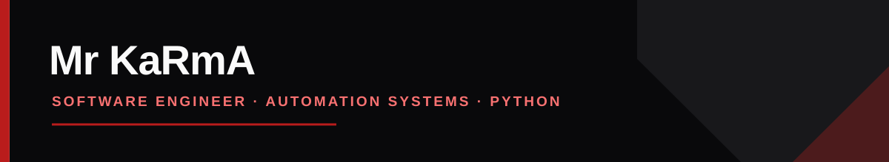

---

## About

I am a software engineer interested in practical software: the kind that removes repetitive work, handles real-world media workflows, and remains simple to operate. I work primarily with Python and Linux, with an emphasis on asynchronous systems, maintainable automation, and privacy-conscious design.

## Currently building

Automation and media tooling with Python, with a focus on fast, practical workflows that are easy to run and maintain.

## Expertise

<table>
<tr>
<td width="50%" valign="top">

### Automation & bots

- Telegram-based workflows
- Asynchronous Python services
- API integrations
- Task-oriented tooling

</td>
<td width="50%" valign="top">

### Systems & media

- Media extraction and processing
- Linux-first development
- Dockerized services
- Lightweight web applications

</td>
</tr>
</table>

## Featured project

<table>
<tr>
<td width="100%">

### [KaRmA Downloader](https://github.com/MrKaRmA69/KaRmA-Downloader)

A focused media extraction and download project. It is built around a simple principle: common download workflows should be reliable, straightforward, and easy to use.

**Focus:** Python · Media workflows · Automation

[Explore the repository →](https://github.com/MrKaRmA69/KaRmA-Downloader)

</td>
</tr>
</table>

## Technical stack

## Engineering approach

> Build with a clear purpose. Automate what repeats. Keep the result understandable.

- Prefer dependable, maintainable systems over unnecessary complexity.
- Design tools around real tasks and clear interfaces.
- Treat privacy and user control as part of the product, not an afterthought.

## GitHub activity

## Open to

I am open to collaborating on Python automation, media tooling, Linux-based utilities, and privacy-conscious open-source projects.

## Connect

[Telegram](https://t.me/TakenByEmma) &nbsp;·&nbsp; [Channel](https://t.me/FuckSoicety) &nbsp;·&nbsp; [Instagram](https://www.instagram.com/4mir69_/)

